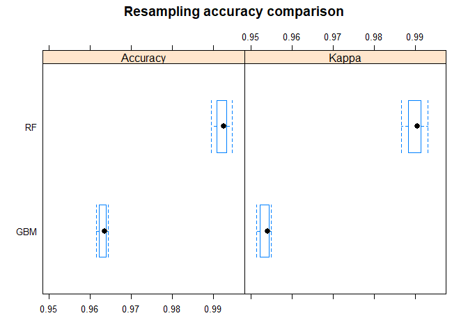
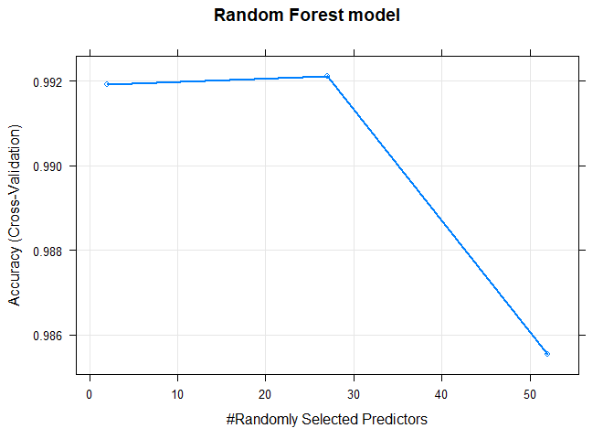

# Practical Machine Learning Course Project
July-2017  
### EXECUTIVE SUMMARY
The objective of this project is to devise a machine learning model that can predict the manner in which a weight lifting exercise was performed based on data collected from wearable sensors on the belt, arm, forearm, and dumbell.  

The plan of approach is to build 2 models for comparison and choose the one with higher accuracy as the final model to be used to predict the 20 test cases provided as part of the project.

It is eventually found that the RF (Random Forest) model performed better than the one built with GBM (Stochastic Gradient Boosting) and was able to give 100% correct predictions on the __*classe*__ outcome for the given 20 test cases.  


### BACKGROUND
An abstract of the Weight Lifting Exercises (WLE) dataset is used for this supervised machine learning project. It is provided courtesy of the Human Activity Recognition research by Velloso, E.; Bulling, A.; Gellersen, H.; Ugulino, W.; Fuks, H. as part of the proceedings of 4th International Conference in Cooperation with SIGCHI (Augmented Human '13). *[1]*

The WLE aspect of the research employed an on-body sensing approach to collect angles, accelerometric, gyroscopic & magnetometric measurements data from 6 participants while they performed the unilateral dumbbell biceps curl exercise. They were directed to do barbell lifts correctly and incorrectly in 5 different ways and the manner in which the exercise was executed was then classified accordingly as data was being collected :-  
Class A - correct method according to execution specifications  
Class B - incorrect manner, throwing elbow to the front  
Class C - incorrect manner, lifting dumbbell only halfway  
Class D - incorrect manner, lowering dumbbell only halfway  
Class E - incorrect manner, throwing hip to the front  


### DATA PROCESSING
#### Load Training Dataset

Download given WLE training dataset from :-  
https://d396qusza40orc.cloudfront.net/predmachlearn/pml-training.csv  


```r
if(!file.exists("../../course_data/pml-training.csv")) {
    fileurl1<-
        "https://d396qusza40orc.cloudfront.net/predmachlearn/pml-training.csv"
    download.file(fileurl1, 
                  destfile= "../../course_data/pml-training.csv")
}

# Read in given data
pmltrn<-data.table(read.csv("../../course_data/pml-training.csv"))

# Dimensions of original training data 
dim(pmltrn)
```

```
## [1] 19622   160
```

```r
# Distribution of outcome variable
table(pmltrn$classe)
```

```
## 
##    A    B    C    D    E 
## 5580 3797 3422 3216 3607
```

#### Data Exploration
* The training dataset comprises of 160 variable columns with 19622 rows. 
* The outcome variable is __*classe*__ along with 159 potential predictors.  
* The table above shows the distribution of the different classe values occurring in the training dataset
* Although there are no missing classifications of the classe outcome variable, a visual overview of the dataset however shows high incidence of missing or NA values in many of the predictor columns.  
  

#### Features Selection
Originally the intent was to model using classification algorithms like GBM and RF and just rely on their inherent built-in feature selection capabilities to work out the best of the 159 potential predictors for use. But as it turned out, a manual culling of variables is still necessary to facilitate model fitting and accuracy.   

As such, variables with the following criteria were excluded as predictors from the training dataset :-  
*  variables with no or low variability  
*  variables having more than 70% missing values  
*  variables that are labels and have no relationship with the outcome


```r
# Identify variables with no variability
Zerovars<-colnames(pmltrn)[nearZeroVar(pmltrn)]

# Identify columns with more than 70% NAs 
NAcnt<-colSums(is.na(pmltrn))
NAcol<-NAcnt>0.7*nrow(pmltrn)
NAvars<-names(NAcnt[NAcol])

# Identify label variables that are not predictors of outcome
Labvars<-colnames(pmltrn[,1:7])

# Consolidate list of variables to be excluded from modeling
Delvars<-append(Labvars,Zerovars)
Delvars<-append(Delvars,NAvars)

# Build new training dataset with selected features
rqdvars<-colnames(pmltrn)[!(colnames(pmltrn) %in% Delvars)]
pmltrn1<-subset(pmltrn, select=rqdvars)
```

At the end of the feature selection exercise, 52 variables remain to be used for predictor selection in the modelling algorithms. 


#### Cross Validation
* For purpose of providing an out of sample error estimate, the given training dataset will be partitioned into 75% for training the model while 25% is set aside for validation of the model.  

* Within the model training function, a 5-fold cross-validation will be used. 


```r
# Partition training dataset
set.seed(98765)
inTrain <- createDataPartition(y=pmltrn1$classe,p=0.75,list=FALSE)
trndat <- pmltrn1[inTrain,]
valdat <- pmltrn1[-inTrain,]
```

### MODELLING

#### 1. Model selection
Classification models using different machine learning algorithms will be built for comparison :- GBM (Stochastic Gradient Boosting) and RF (Random Forest).  

The caret::train function will be used to build the models.  

To improve processing time, parallel processing function will be initiated for the model training process as per guidance from Len Greski (course mentor) *[2]* 


```r
cluster <- makeCluster(detectCores() - 1)
registerDoParallel(cluster)

fitctrl<-trainControl(method="cv",number=5,allowParallel=TRUE)

system.time({
set.seed(98765)
fit1<-train(classe~.,data=trndat,method="gbm",trControl=fitctrl,
            verbose=FALSE)
})
```

```
##    user  system elapsed 
##   75.67    4.94  462.29
```

```r
system.time({
set.seed(98765)
fit2<-train(classe~.,data=trndat,method="rf",trControl=fitctrl)
})
```

```
##    user  system elapsed 
##  308.03    4.53 2478.66
```

```r
stopCluster(cluster)
registerDoSEQ()
```

#### 2. Evaluation of model fits


```r
# Compare models
cm1<-confusionMatrix(valdat$classe,predict(fit1,valdat))
cm2<-confusionMatrix(valdat$classe,predict(fit2,valdat))
cmres<-resamples(list(GBM=fit1, RF=fit2))
summary(cmres)
```

```
## 
## Call:
## summary.resamples(object = cmres)
## 
## Models: GBM, RF 
## Number of resamples: 5 
## 
## Accuracy 
##          Min.   1st Qu.    Median      Mean   3rd Qu.      Max. NA's
## GBM 0.9616168 0.9622706 0.9636549 0.9631742 0.9639823 0.9643463    0
## RF  0.9894737 0.9908226 0.9925272 0.9921187 0.9932065 0.9945634    0
## 
## Kappa 
##          Min.   1st Qu.    Median      Mean   3rd Qu.      Max. NA's
## GBM 0.9514280 0.9522673 0.9540314 0.9534099 0.9544351 0.9548876    0
## RF  0.9866841 0.9883896 0.9905476 0.9900302 0.9914064 0.9931231    0
```

```r
bwplot(cmres,main="Resampling accuracy comparison")
```

<!-- -->

Summary and plot of resampling results show the RF model provides higher accuracy rates with a maximum of 0.994 as opposed to GBM at 0.964.

Confusion matrix for prediction on validation data

**GBM model :-**  


         A     B     C     D     E
---  -----  ----  ----  ----  ----
A     1368    20     3     3     1
B       26   902    20     0     1
C        0    22   814    17     2
D        1    11    27   757     8
E        0    13     9    16   863

  

**RF model :-**  


         A     B     C     D     E
---  -----  ----  ----  ----  ----
A     1390     4     1     0     0
B        5   942     2     0     0
C        0     2   849     4     0
D        0     1     4   798     1
E        0     1     0     0   900

  


#### 3. Chosen model
The better model to use for prediction in this case is the Random Forest algorithm as it gives a higher accuracy rate.  


```r
# Show final model plot
plot(fit2,main="Random Forest model",lwd=2)
```

<!-- -->

### CONCLUSIONS
The final machine learning model selected for use was the one built with the __*Random Forest*__ algorithm having an __*out of sample error rate*__ at __*0.51%*__.  

With this model, it was possible to obtain 100% correct predictions on the __*classe*__ outcome for the given 20 unknown test cases.  
    
    
    
_____   
#### References
[1]  Velloso, E.; Bulling, A.; Gellersen, H.; Ugulino, W.; Fuks, H. Qualitative Activity Recognition of Weight Lifting Exercises. Proceedings of 4th International Conference in Cooperation with SIGCHI (Augmented Human '13) . Stuttgart, Germany: ACM SIGCHI, 2013.  
[Read more](http://groupware.les.inf.puc-rio.br/har#weight_lifting_exercises#ixzz4nAOT0hYy)

[2]  Len Greski. [Improving performance of Random Forest in caret::train](https://github.com/lgreski/datasciencectacontent/blob/master/markdown/pml-randomForestPerformance.md)
